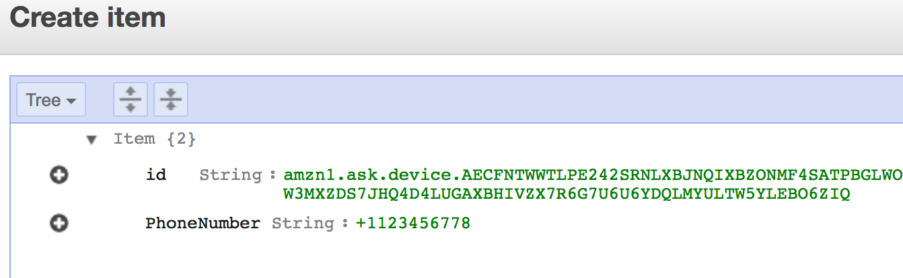

# Alexa Skill Authentication Sample

## About the Alexa skill 

This Alexa Skill provides users the ability to get flash briefings on Company's KPI's. The Skill demonstrates how to use AWS Lambda and SNS to enable Voice + SMS based Authentication within a Skill. You will also learn to Publish this Skill as a Private skill to an Alexa for Business account rather than the public Alexa Skills Store.

## Skill Deployment
This demo assumes you have your developer environment ready to go and that you have some familiarity with CLI (Command Line Interface)Tools, AWS, and the ASK Developer Portal. 

### Pre-requisites

* Node.js (> v8)
* Register for an [AWS Account](https://aws.amazon.com/)
* Register for an [Amazon Developer Account](https://www.amazon.com/ap/signin?clientContext=133-6034629-5039663&openid.return_to=https%3A%2F%2Fdeveloper.amazon.com%2F&openid.identity=http%3A%2F%2Fspecs.openid.net%2Fauth%2F2.0%2Fidentifier_select&openid.assoc_handle=mas_dev_portal&openid.mode=checkid_setup&marketPlaceId=ATVPDKIKX0DER&openid.claimed_id=http%3A%2F%2Fspecs.openid.net%2Fauth%2F2.0%2Fidentifier_select&pageId=amzn_developer_portal&openid.ns=http%3A%2F%2Fspecs.openid.net%2Fauth%2F2.0&siteState=clientContext%3D145-5959710-0079802%2CsourceUrl%3Dhttps%253A%252F%252Fdeveloper.amazon.com%252F%2Csignature%3D2Hg5BEEq0ZTVj2FnmzejmIGaPLwIsj3D&language=en_US)
* Install and Setup [ASK CLI](https://developer.amazon.com/docs/smapi/quick-start-alexa-skills-kit-command-line-interface.html)

### Installation
1. **Clone** the repository.

    ```bash
    $ git clone https://github.com/aws-samples/alexa-skill-authentication
    ```

2. If it's your first time using it, **initiatialize** the ASK CLI by navigating into the repository and running ask command: `ask init`. Follow the prompts. This will initialize credentials profile and help you configure credentials to access Alexa Skills Kit Developer Console and the AWS Console.

	```bash
	$ cd alexa-skill-authentication
	$ ask init
	```

3. Install npm dependencies by navigating into the `/lambda/custom` directory and running the npm command: `npm install`

    ```bash
    $ cd lambda/custom
    $ npm install
    ```

### Deploy the Skill
   
1. Deploy the skill by running the following command in the `alexa-skill-authentication` folder. 

    ```bash    
    $ ask deploy 
    ```
    The Skill would be deployed. Ignore any errors related to enabling the skill. You will Enable it in the subsequent steps. Make a note of the Skill Id as shown in the output below. 

    ```bash    
    Skill Id: amzn1.ask.skill.fede81a9-09a7-4b46-85f3-1fea4a96f
    Skill deployment finished.
    Model deployment finished.
    [Info]: No lambda functions need to be deployed.
    [Info]: No in-skill product to be deployed.    
    ```

2. In the root directory `alexa-skill-authentication`, you should see a file named 'deploy-lambda.sh'. This will let you deploy the Skill's backend code as a Lambda function. Ensure you edit this file to replace the name of the S3 bucket as found in your AWS account.

3. Deploy the lambda function by executing the `deploy-lambda.sh` file (Change permissions of this file by executing the command `chmod +x deploy-lambda.sh` if need be.). Make note of the name of the Lambda function and its ARN. You will need it in subsequent steps.

4. Configure the Alexa Skill Kit as a Trigger to the Lambda function by running this command.


    ```bash    
    $ aws lambda add-permission \
    --function-name LAMBDA_FUNCTION_NAME \
    --statement-id 123 \
    --action lambda:InvokeFunction \
    --principal alexa-appkit.amazon.com \
    --event-source-token SKILL_ID
    ```
    **Note**: Replace the LAMBDA_FUNCTION_NAME and SKILL_ID values appropriately.

5. In the root directory `alexa-skill-authentication`, edit the `skill_final.json` by replacing the ARN of the Lambda function created in Step 3. Look for the place holder LAMBDA_ARN in this file.

6. Replace the contents of the `skill.json` with the contents in `skill_final.json`.

7. Re-deploy the skill by running the following command. 

    ```bash    
    $ ask deploy --force
    ```
    The Skill should be deployed and linked to the Lambda function.

    ```bash    
    Skill Id: amzn1.ask.skill.fede81a9-09a7-4b46-85f3-1fea4a96f
    Skill deployment finished.
    Model deployment finished.
    [Info]: No lambda functions need to be deployed.
    [Info]: No in-skill product to be deployed.
    Your skill is now deployed and enabled in the development stage. Try simulate your Alexa skill skill using "ask dialog" command.
    ```

8. Test the Skill. Refer to ```Testing the Skill``` section for Instructions on testing the skill.

9. Submit the skill. The submission process is similar to certification for public skills. Just issue the following command:
    ```bash    
    ask api submit -s SKILL_ID
    ```
    **Note**: Replace the value of SKILL_ID.

    This submission process may take about 90 minutes to complete and once completed the skill will be available in the live stage.

### Distribute as Private Skill
Ensure that the Skill's Status is `Live` before executing this step. The final step is to distribute the skill to an Alexa for Business organization.  To do this, you’ll need the ARN of the AWS account for the organization which you want to deploy the skill. Then enter the following command:

```bash    
$ ask api add-private-distribution-account -s SKILL_ID --stage live --account-id <id>
```

For example

```bash    
ask api add-private-distribution-account -s  amzn1.ask.skill.fede81a9-09a7-4b46-85f3-1fea4a96f --stage live --account-id arn:aws:iam::1234567890:root
```

### Testing the Skill

1. Invoke the Skill by saying "Alexa, Open Business Insights"
2. Then ask "How is the Net profit Margin?". Alexa will respond with 
"Your mobile number is not registered with this device. Please contact the skill administrator."
3. You will need to locate the **DeviceId** and map it to your Mobile Number in a DynamoDB Table.
4. To locate the DeviceId, login to the AWS Management Console. Choose Lambda and click on Functions in the left navigation pane. Locate the Lambda function configured with this Skill.
5. Choose the Lambda function and click on the **Monitoring** tab. 
6. Click on **View logs in CloudWatch** and click on the first "Log Stream". 
7. Look for the **DeviceId** in the logs. It starts with the prefix "amzn1.ask.device.". Note this DeviceId.
8. Navigate to **DynamoDB** in the AWS Management Console.
9. Choose **Tables** in the left navigation pane.
10. Locate the **DeviceContactMapping** table and click on **CreateItem**.
11. Add the value of DeviceId into the Id Attribute and also add a new attribute called PhoneNumber. Enter your Mobile Number starting with the CountryCode.Click on **Save** to save this Item.

    

13. Invoke the Skill by saying "Alexa, Open Business Insights"
14. Then ask "How is the Net profit Margin?".
15. The Alexa Skill will send a 4 Digit PIN via SMS. The Skill will prompt you to Utter the 4 Digit PIN.
16. Provide a valid PIN and Alexa should now respond with the KPI Information.


## License

This library is licensed under the Amazon Software License.


